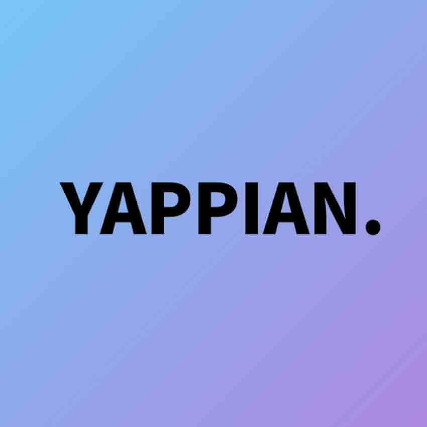

	

	<strong>IT 프로젝트 동아리 Yapp의 프로젝트 진행상황 공유 및 아카이빙 웹 서비스</strong>
	
2019.02 - 2019.06

# About YAPPIAN

시연 영상 : https://www.youtube.com/watch?v=ch9cgmcZ2hY

동아리의 기수별로 프로젝트별 진행 상황, 산출물, 협업툴을 볼 수 있고 '완료’된 프로젝트는 설명과 url 등을 기입하여 완료처리가 되어 보여지게 됩니다.

- **메인화면** : 완료된 프로젝트를 기수별로 조회

- **로그인** : google로그인 api 연동

- **CRUD(생성,조회,수정,삭제)** : 프로젝트 내에서 사용한 자료 링크 url, 협업툴 url

- **파일업로드** : 프로젝트가 완료하기 버튼을 클릭 -> 대표이미지 파일과 pdf 파일, 프로젝트 정보 입력 후, 업로드 (프로젝트 완료 처리 부분)
- **프로젝트 아카이빙** : 프로젝트 완료 시 기입한 정보 (pdf파일, 설명 등 프로젝트 정보) 보여짐.

# Skill stacks 
- React JS, axios
- Javascript ES6+, 
- HTML/CSS
- React-Router-Dom v4

## License

- **[MIT license](http://opensource.org/licenses/mit-license.php)**
